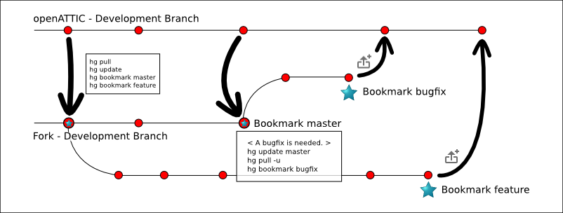

.. _developer_contribute:

Contribute to |oA|
==================

This is an introduction on how to contribute to |oA|.

The |oA| source code is managed using the `Mercurial <https://www.mercurial-scm.org/>`_ revision control system.
Mercurial offers you a full-fledged source control, where you can commit and
manage your source code.

Working on your fork
--------------------

A fork is a remote clone of a repository and every |oA| developer has an |oA|
fork, to get one you first have to join Bitbucket. After that go to
https://bitbucket.org/openattic/openattic and click on "Fork" on the left side
under "ACTIONS".

After that you have your own |oA| fork :)

Please make sure you've followed the instructions described in chapter :ref:`developer_setup_howto`.
This means you have cloned the |oA| repository.
In your local clone edit the Mercurial configuration file `.hg/hgrc`. It
should contain the following three lines::

    [paths]
    default = https://hg@bitbucket.org/openattic/openattic
    default-push = https://hg@bitbucket.org/<Your user name>/openattic

With this configuration you always pull from the main |oA| repository and always
push to your |oA| fork.

If you want to push via SSH, you can. You only have to replace your default-push with::

    default-push = ssh://hg@bitbucket.org/<Your user name>/openattic

If you want to use SSH behind a proxy install `corkscrew <http://agroman.net/corkscrew/>`_. Now append the
following two lines to your `$HOME/.ssh/config`::

    Host bitbucket.org
        ProxyCommand corkscrew <proxy name or ip> <port number> %h %p

Now you can use SSH behind your proxy, because corkscrew now tunnels your TCP
connections to bitbucket.org through the proxy.

Working with bookmarks
----------------------

First create a bookmark called "master" in your "development" branch,
you only have to do this once::

    # hg update development
    # hg pull
    # hg update
    # hg bookmark master

Now you can update your development branch and your master bookmark like this::

    # hg update master
    # hg pull
    < If anything was pulled, update your "master" bookmark. >
    # hg update

To create a new feature bookmark go into your "master" bookmark and create a
new bookmark in which you commit your feature changes::

    # hg update master
    # hg bookmark feature
    < Your code changes. >
    # hg commit

To list your bookmarks and show the current bookmark you are working in type::

    # hg bookmark

For example the output could be::

    >   feature                   1838:28ba1c97ef35
    > * bugfix                    1841:a1b2c3d4e5f6
    >   master                    1837:1a23b45c67ef

In this case you are working on the bookmark "bugfix". Your "master" bookmark
is behind your "feature" and your "bugfix" bookmark. This means you have two
heads in your development branch. The "feature" head and the "bugfix" head.

After you are done with your changes, you want to push them to your fork::

    # hg push -B <bookmark name>

If you can't push them because a new remote head would be created use::

    # hg push -B <bookmark name> -f

Now that your fork has your local changes, too, you can create a
pull-request with the changes you have made. If your pull-request was merged
into the main repository, you have to manually merge the accepted bookmark in
your "master" bookmark. After that you can delete your local bookmark for a
better overview::

    # hg update master
    # hg merge <accepted bookmark>
    # hg bookmark -d <accepted bookmark>

A few information why the merge is needed:
After the pull request was merged into the main repository, your first
committed changeset often has a new parent, but a hg pull looks only for new
changesets not if they have a new parent. If you run hg pull it will have no
new changesets for you. Thats why you have to manually merge your bookmark into
your master. This will close the head if one exists. If there is no new
head you can also just update your master.

The following images illustrate the concept.

.. image:: workflow_bitbucket.png

Shows the different repositories and how they work together.

Describes the workflow with bookmarks.

-------------------------

**To sum it up**

Work on this bookmark::

    # hg update <bookmark name>

Fetch new revisions from |oA|::

    # hg pull

Bring your bookmark to the newest revision::

    # hg update

Create a new bookmark on the current revision and update to the new bookmark::

    # hg bookmark <bookmark name>

Create a new bookmark on the given revision::

    # hg bookmark <bookmark name> -r <bookmark name or revision>

Delete the specified bookmark, the commits will still be there::

    # hg bookmark -d <bookmark name>

Lists all bookmarks with revisions and shows you on which you are working::

    # hg bookmark

Merges a bookmark into the current bookmark you are working in::

    # hg merge <bookmark name>

Export your specified bookmark to your fork and pushes your changes::

    # hg push -B <bookmark name>

Does the above and forces the push even if a new head is created::

    # hg push -B <bookmark name> -f

