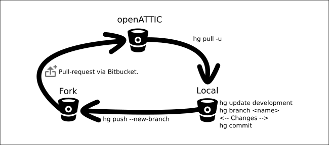
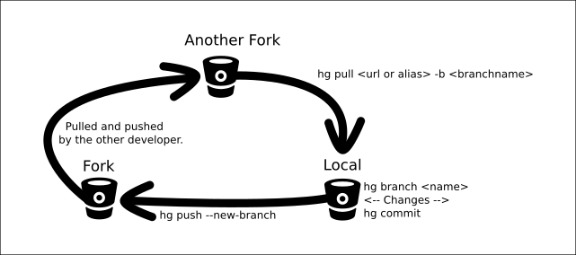
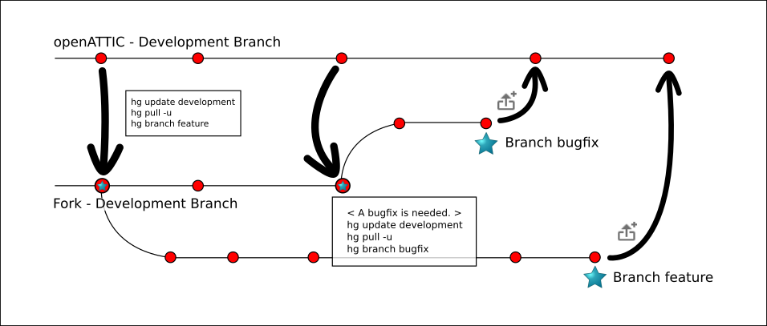

.. _developer_contribute:

Contribute to |oA|
==================

This is an introduction on how to contribute to |oA|.

The |oA| source code is managed using the `Mercurial <https://www.mercurial-scm.org/>`_ revision control system.
Mercurial offers you a full-fledged source control, where you can commit and
manage your source code.

Working on your fork
--------------------

A fork is a remote clone of a repository and every |oA| developer has an |oA|
fork, to get one you first have to join `Bitbucket <https://bitbucket.org>`_. After that go to
`our main repository <https://bitbucket.org/openattic/openattic>`_ and click "Fork" on the left side
under "ACTIONS".

After that you have your own |oA| fork :)

Please make sure you've followed the instructions described in chapter :ref:`developer_setup_howto`.
This means you have cloned the |oA| repository.
In your local clone edit the Mercurial configuration file `.hg/hgrc`. It
should contain the following three lines::

    [paths]
    default = https://hg@bitbucket.org/openattic/openattic
    default-push = https://hg@bitbucket.org/<Your user name>/openattic

With this configuration you will always pull from the main |oA| repository and always
push to your |oA| fork.

If you want to push via SSH, you will only have to replace your ``default-push``::

    default-push = ssh://hg@bitbucket.org/<Your user name>/openattic

If you want to use SSH behind a proxy you may use `corkscrew <http://agroman.net/corkscrew/>`_.
After the installation append the following two lines to your `$HOME/.ssh/config`::

    Host bitbucket.org
        ProxyCommand corkscrew <proxy name or ip> <port number> %h %p

Now you can use SSH behind the proxy, because corkscrew now tunnels your SSH
connections through the proxy to bitbucket.org.

Working with branches
---------------------

To create a new feature branch update your repository, change to the development branch and
create your new branch on top of it, in which you commit your feature changes::

    # hg pull
    # hg update development
    # hg branch feature
    < Your code changes. >
    # hg commit

To list your branches type::

    # hg branches

To see the current branch you are working with type::

    # hg branch

After you are done with your changes, you want to push them to your fork::

    # hg push

If you can't push them because a new remote branch would be created use::

    # hg push --new-branch

Now that your fork contains your local changes, too, you can create a
pull-request on `Bitbucket <https://bitbucket.org>`_ with the changes you have made.

To do this, go to your fork on `Bitbucket <https://bitbucket.org>`_ and click ``Create pull request`` in the left panel.
On the next page, choose as source the branch with your changes and as target the |oA| development branch.
Beneath the formula your first check out the ``Diff`` part if there are any merge conflicts,
if you have some, you have go back into your branch and update it::

    # hg pull
    # hg merge development

After you have resolved the merge conflicts you have to push them on your fork and make the pull-request.

After the pull-request was reviewed and accepted your branch will be merged into the main repository.
Then your branch will be deleted by the maintainer.
Please do not delete your branch, because after pulling from the main repository,
you'll also get a changeset which deletes your branch.

To push the deletion to your fork again you have to the following::

    #hg pull -u
    #hg push

Collaborate with others or test their code
------------------------------------------

To pull a branch from another developer type the following::

    # hg pull <alias or fork URL> <branch name>

If you plan to contribute something to the branch you have to push your changes to your fork.
The other developer can pull the changes the other way round, see hg command above.

To create and use an alias you have to edit your ``.hg/hgrc`` and add a new alias beneath ``[paths]``::

    <alias name> = <fork clone URL>

---------------

The following images illustrate this concept.

Shows the workflow between the main repository and your fork.

Illustrates the collaborate workflow between two forks.

Describes the workflow with branches.

-------------------------

**To sum it up**

Work on a specific branch::

    # hg update <branch name>

Fetch new revisions from |oA|::

    # hg pull -u

Merge your branch to the latest revision::

    # hg pull -u
    # hg merge development

Create a new branch on top of the current working branch::

    # hg branch <branch name>

Lists all open branches::

    # hg branches

Show current working branch::

    # hg branch

Merges a branch into the current working branch::

    # hg merge <branch name>

Push your changes on your fork::

    # hg push

Does the above, but creates a new branch or deletes an old one::

    # hg push --new-branch

